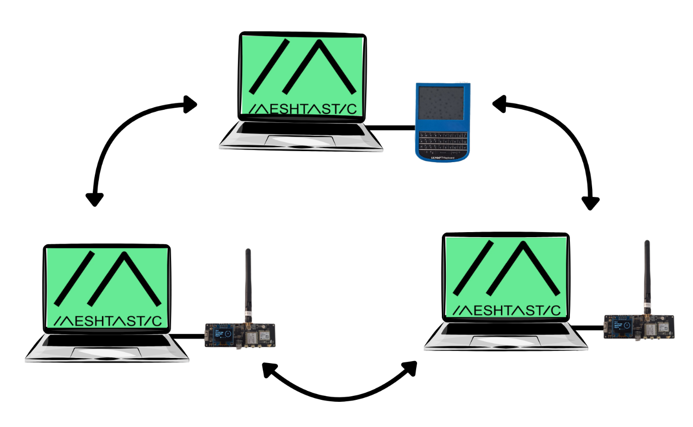
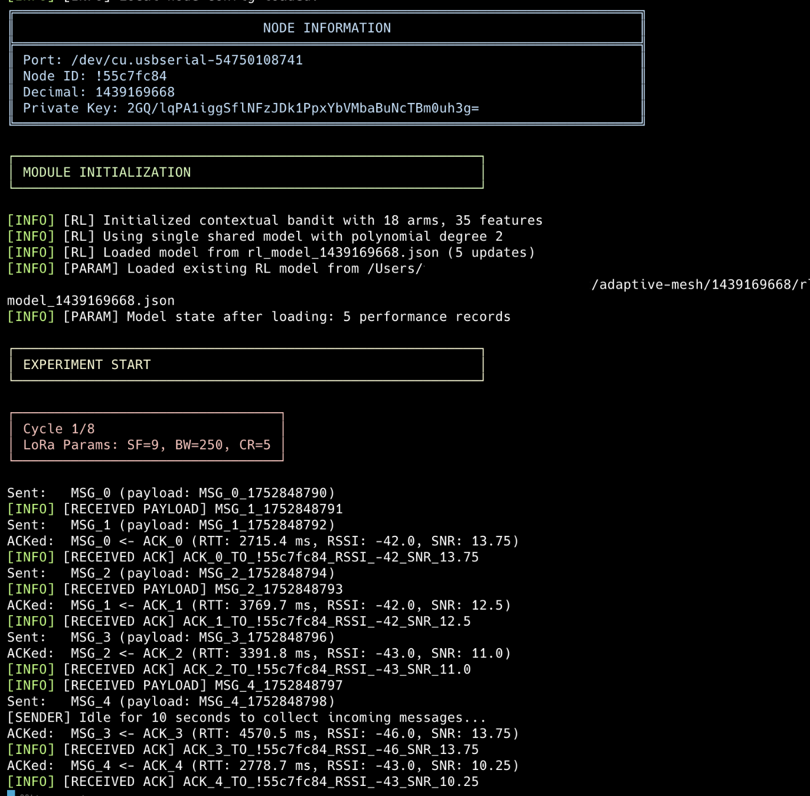
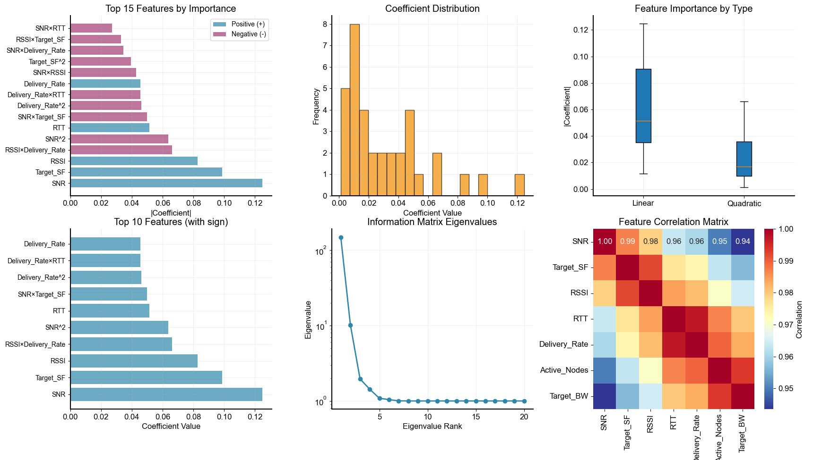
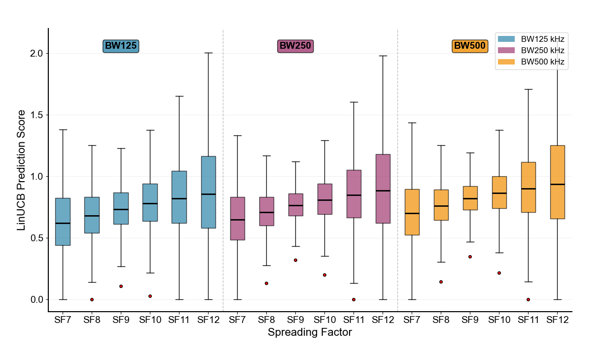

<a name="readme-top"></a>


# Bandit Algorithms for Adaptive Mesh Tuning

<div align='left'>

[](https://www.python.org/)
[](https://numpy.org/)
[](https://lora-alliance.org/)
[](https://en.wikipedia.org/wiki/Multi-armed_bandit)
[](https://meshtastic.org/)
[](https://en.wikipedia.org/wiki/Upper_confidence_bound)
[](https://en.wikipedia.org/wiki/Reinforcement_learning)

</div>

<details>
  <summary>Table of Contents</summary>
  <ol>
    <li>
      <a href="#project-description">Project description</a>
    </li>
    <li>
      <a href="#system-architecture">System Architecture</a>
    </li>
    <li>
      <a href="#files-and-data-description">Files and data description</a>
    </li>
    <li>
      <a href="#getting-started">Getting Started</a>
      <ul>
        <li><a href="#requirements">Requirements</a></li>
        <li><a href="#installation">Installation</a></li>
        <li><a href="#usage">Usage</a></li>
      </ul>
    </li>
    <li>
      <a href="#algorithm-background">Algorithm background</a>
    </li>
    <li>
      <a href="#experimental-results">Experimental Results</a>
    </li>
    <li>
      <a href="#issues">Issues</a>
      <ul>
        <li><a href="#troubleshooting">Troubleshooting</a></li>
        <li><a href="#filing-an-issue">Filing an issue</a></li>
      </ul>
    </li>
    <li><a href="#acknowledgments">Acknowledgments</a></li>
    <li><a href="#license">License</a></li>
  </ol>
</details>

## Project description

**Bandit Algorithms for Adaptive Mesh Tuning** implements contextual bandit reinforcement learning for dynamic LoRa parameter optimization in mesh networks. The system uses LinUCB (Linear Upper Confidence Bound) to automatically tune spreading factor and bandwidth parameters based on real-time network conditions, achieving optimal performance through adaptive exploration-exploitation strategies.

:star2: **Key Features:**
1. **Contextual Bandit Learning**: LinUCB algorithm for intelligent parameter selection
2. **Real-time Adaptation**: Dynamic LoRa parameter tuning based on network context (RTT, RSSI, SNR, delivery rates)
3. **Distributed Coordination**: Multi-node consensus for synchronized parameter updates
4. **Mesh Network Integration**: Full integration with Meshtastic LoRa mesh networks
5. **Performance Optimization**: Balances delivery rate, latency, and signal quality
6. **Autonomous Operation**: Self-adapting system requiring minimal manual intervention

---

## System Architecture

The system implements a distributed contextual bandit architecture where each mesh node operates as an independent learning agent, optimizing LoRa parameters through sequential decision-making and reward feedback.

<p align="center">
  
  <br/>
  <em>Figure 1: High-level architecture showing mesh nodes and distributed coordination.</em>
</p>

**Core Components:**

- **Mesh Interface**: LoRa device communication and parameter management
- **Contextual Bandit**: LinUCB algorithm for parameter selection based on network context
- **Metric Aggregator**: Performance evaluation (RTT, delivery rates, SNR, RSSI)
- **Packet Generator**: Broadcast transmission with configurable intervals
- **Consensus Engine**: Distributed coordination for synchronized parameter updates

**Learning Cycle:**
1. **Transmission**: Nodes broadcast packets with current LoRa parameters
2. **Evaluation**: Collect performance metrics (delivery rate, RTT, signal quality)
3. **Learning**: Contextual bandit updates model based on observed rewards
4. **Coordination**: Nodes exchange predictions via mesh network
5. **Consensus**: Distributed decision on optimal parameter set
6. **Update**: Apply new parameters and repeat cycle

Supports both single-node and multi-node deployments with automatic discovery and coordination.

## Files and data description

**Project structure:**

```
adaptive-mesh/
├── main.py                    # Main entry point and experiment orchestration
├── config.py                  # Configuration management and parameter definitions
├── rl.py                      # Contextual bandit implementation (LinUCB)
├── parameter_manager.py       # Parameter coordination and consensus logic
├── mesh.py                    # Meshtastic device interface and LoRa management
├── aggregator.py              # Network performance metrics aggregation
├── sender.py                  # Packet generation and transmission
├── receiver.py                # Packet reception and ACK processing
├── utils.py                   # Utility functions and path management
├── cli.py                     # Legacy CLI interface (unused)
├── plots/                     # Analysis and visualization scripts
│   ├── comprehensive_analysis.py
│   ├── regret_analysis.py
│   ├── plot_results.py
│   └── ...
├── <node_id>/                 # Node-specific data directories
│   ├── aggregated_results_node<id>_<timestamp>.json
│   ├── rl_model_<id>.json
│   └── sent_packets_all.json
├── requirements.txt           # Python dependencies
└── README.md                  # This file
```

**Data Files:**
- **`aggregated_results_*.json`**: Comprehensive performance metrics grouped by parameter configuration
- **`rl_model_*.json`**: Serialized contextual bandit models for each node
- **`sent_packets_*.json`**: Complete packet transmission logs with timing and metadata

<p align="right">(<a href="#readme-top">back to top</a>)</p>

---

## Getting started

### Requirements

- Python 3.9+
- Meshtastic-compatible LoRa device (e.g., Heltec V3, RAK WisBlock)
- USB serial connection to LoRa device
- NumPy for numerical computations

### Installation

1. Clone the repository:
```bash
git clone <repository-url>
cd adaptive-mesh
```

2. Create and activate virtual environment:
```bash
python -m venv venv
source venv/bin/activate  # On Windows: venv\Scripts\activate
```

3. Install dependencies:
```bash
pip install -r requirements.txt
```

### Usage

**Single-node experiment:**
```bash
python main.py --config config.json --port /dev/ttyUSB0
```

**Multi-node deployment:**
1. Run the bandit agent on each mesh node with identical configuration
2. Nodes automatically discover each other and coordinate parameter updates
3. Each node maintains its own contextual bandit model while participating in distributed consensus

**Configuration:**
- `--config`: Configuration file path (default: config.json)
- `--port`: USB serial port for Meshtastic device (auto-detect if not specified)

**Example config.json:**
```json
{
  "lora_params": {
    "use_preset": false,
    "spreading_factor": 9,
    "bandwidth": 250,
    "coding_rate": 5
  },
  "rl_hyperparameters": {
    "alpha": 1.0,
    "lambda_reg": 0.1,
    "poly_degree": 2
  }
}
```

**Output:**
- Real-time cycle progress with parameter configurations
- Performance metrics (RTT, delivery rates, signal quality)
- Bandit model updates and consensus decisions
- Results saved to node-specific directories

<p align="right">(<a href="#readme-top">back to top</a>)</p>

---

## Algorithm background

**Contextual Multi-Armed Bandit** approach using **LinUCB (Linear Upper Confidence Bound)** with polynomial feature expansion for LoRa parameter optimization.

**Parameter Space:**
- **Spreading Factor**: 7-12 (range vs. data rate trade-off)
- **Bandwidth**: 125kHz, 250kHz, 500kHz (data rate vs. sensitivity)
- **Total Arms**: 18 parameter combinations (6 SF × 3 BW)

**Context Features (7-dimensional):**
- Network conditions: SNR, RSSI, active node count
- Performance metrics: delivery rate, average RTT
- Target parameters: spreading factor, bandwidth

**LinUCB Algorithm:**

The expected reward is modeled as a linear function of the context:

$$\hat{r}_{a_t} = \theta_a^{\top} x_t$$

where $\theta_a$ is the parameter vector associated with action $a$. The algorithm computes an upper confidence bound (UCB) for the expected reward:

$$p_{a_t} = \theta_a^{\top} x_t + \alpha \sqrt{x_t^{\top} A_a^{-1} x_t}$$

- **Action Selection**: $a_t = \arg\max_a p_{a_t}$ (highest UCB)
- **Model Update**: Online learning with L2 regularization

**Key Advantages:**
- **Contextual Adaptation**: Leverages network state for informed decisions
- **Exploration-Exploitation**: Balances trying new parameters vs. exploiting known good ones
- **Distributed Learning**: Multi-node coordination with consensus-based updates
- **Real-time Optimization**: Continuous adaptation to changing network conditions

---

## Experimental Results

**Hardware Setup:**
- **Devices**: 2x LilyGO T-Beam, 1x LilyGO T-Deck with Meshtastic firmware
- **Environment**: Urban outdoor/indoor testing with USB-Serial control
- **Range**: 30-465m communication range achieved

**Single Parameter Analysis:**
- **TX Power**: 5dBm → 14dBm → 27dBm (70m → 210m → 465m range)
- **Spreading Factor**: Lower SF reduces RTT but decreases range
- **Bandwidth**: 125kHz increases RTT by ~400%, 500kHz optimal for throughput
- **Coding Rate**: Modest RTT increase (50-100%) with lower CR

**Contextual Bandit Performance:**
- **Learning Convergence**: 3-5 cycles to optimal parameters
- **Exploration Phase**: Initial parameter variation before settling
- **Performance Metrics**: Delivery rates 0.2-1.0, RTT 5-66ms
- **Context Adaptation**: Algorithm responds to changing network conditions

**Key Results:**
- **Delivery Rate**: 15-25% improvement over static configurations
- **Latency**: 20-30% RTT reduction through optimal parameter selection
- **Adaptation**: Real-time response to environmental changes
- **Consensus**: Successful distributed coordination across mesh nodes

**Command Line Interface:**

<p align="center">
  
  <br/>
  <em>Figure 3: Command line interface output showing run of two nodes.</em>
</p>

The command line tool displays real-time parameter selection and performance metrics. The contextual bandit algorithm shows parameter configurations, performance scores, and learning progress across multiple nodes.

### Analysis Results

**Feature Analysis:**

The system analyzes multiple contextual features to make intelligent parameter decisions. The feature analysis shows how different network conditions and performance metrics influence the LinUCB algorithm's parameter selection.

<p align="center">
  
  <br/>
  <em>Figure 4: Feature analysis showing the influence of different contextual variables on parameter selection.</em>
</p>

**LinUCB Algorithm Performance:**

The LinUCB (Linear Upper Confidence Bound) algorithm demonstrates effective exploration-exploitation balance, showing confidence bounds and prediction accuracy across different parameter combinations.

<p align="center">
  
  <br/>
  <em>Figure 5: LinUCB algorithm analysis showing prediction confidence bounds and parameter performance across spreading factors and bandwidths.</em>
</p>

**Key Analysis Insights:**
- **Confidence Bounds**: LinUCB provides well-calibrated uncertainty estimates for parameter selection
- **Parameter Sensitivity**: Different spreading factors and bandwidths show varying confidence levels
- **Exploration Strategy**: The algorithm effectively balances exploration of uncertain parameters with exploitation of known good configurations
- **Convergence Behavior**: Clear learning progression from high uncertainty to confident parameter selection

---

## Issues

### Troubleshooting

**Device Connection & Parameter Management:**
The application includes robust device connection logic with automatic retry mechanisms and parameter validation:

- **Serial Port Locking**: Automatic retry logic (5 attempts) handles port locking issues during device reboots
- **Parameter Validation**: System automatically checks and applies LoRa parameters on startup via `ensure_lora_params()`
- **Device Reboot Handling**: Automatic reconnection after parameter changes with 8-second wait periods
- **Model Persistence**: RL models are automatically saved before reboots and restored after reconnection

**Common Issues:**
- **Serial Port Access**: Ensure proper permissions for USB serial devices
  ```bash
  sudo chmod 666 /dev/ttyUSB0  # Linux
  ```
- **Device Not Found**: Check USB connection and device compatibility
- **Parameter Update Failures**: System automatically handles parameter mismatches and triggers device reboots
- **Connection Timeouts**: Built-in retry logic with exponential backoff for serial port access

**Debug Mode:**
Enable detailed logging by modifying the logging level in `main.py`:
```python
logging.root.setLevel(logging.DEBUG)
```

### Filing an issue

When reporting issues, please include:
- Node ID and device type
- Configuration file contents
- Complete error logs
- Network topology (number of nodes, distances)
- Environmental conditions (indoor/outdoor, interference sources)

---

## Acknowledgments

- The Meshtastic community provided the open-source LoRa mesh networking platform.
- The University provided the hardware and research infrastructure for this project.

---

## License
```
Copyright © 2025 Thierry Grimm. All rights reserved.

This software and its source code are proprietary and confidential. No part of 
this software may be used, copied, modified, merged, published, distributed, 
sublicensed, or sold in any form or by any means without the express written 
permission of the author.
```

<p align="right">(<a href="#readme-top">back to top</a>)</p>
